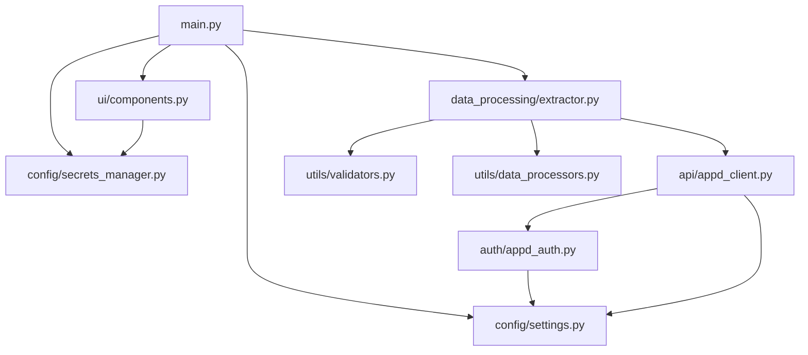

# AppDynamics Data Extractor - Architecture Documentation

## Overview

The AppDynamics Data Extractor has been refactored from a monolithic 1,697-line file into a modular, maintainable architecture following Python best practices and software engineering principles.

## Architecture Principles

### 1. Separation of Concerns
Each module has a single, well-defined responsibility:
- **Configuration**: Settings and secrets management
- **Authentication**: API authentication and token management
- **API Layer**: REST API communication
- **Data Processing**: Business logic and data transformation
- **UI**: User interface components
- **Utilities**: Common helper functions

### 2. Dependency Injection
Modules depend on abstractions, not concrete implementations, making the code more testable and flexible.

### 3. Single Responsibility Principle
Each class and function has one reason to change, making the code easier to understand and maintain.

### 4. Open/Closed Principle
The architecture is open for extension but closed for modification, allowing new features to be added without changing existing code.

## Module Dependencies



## Detailed Module Analysis

### Configuration Module (`config/`)

**Purpose**: Centralized configuration and secrets management

**Components**:
- `settings.py`: Application configuration with type hints
- `secrets_manager.py`: YAML-based secrets storage and retrieval

**Key Features**:
- Type-safe configuration with dataclasses
- Environment variable support
- Encrypted secrets storage
- Validation of configuration values

**Benefits**:
- Single source of truth for configuration
- Easy to modify settings without code changes
- Type safety prevents configuration errors

### Authentication Module (`auth/`)

**Purpose**: AppDynamics API authentication and session management

**Components**:
- `appd_auth.py`: OAuth token management and session handling

**Key Features**:
- Automatic token refresh
- Session persistence
- Token validation
- Error handling for authentication failures

**Benefits**:
- Isolated authentication logic
- Reusable across different API clients
- Easy to test and mock

### API Module (`api/`)

**Purpose**: REST API communication with AppDynamics

**Components**:
- `appd_client.py`: Unified API client with consistent error handling

**Key Features**:
- Centralized error handling
- Consistent request/response patterns
- URL encoding utilities
- Response validation

**Benefits**:
- Single point of API interaction
- Consistent error handling
- Easy to add new endpoints
- Reusable across different parts of the application

### Utilities Module (`utils/`)

**Purpose**: Common helper functions and data processing utilities

**Components**:
- `validators.py`: Data validation and parsing utilities
- `data_processors.py`: Data transformation and business logic

**Key Features**:
- JSON/XML validation and parsing
- Data transformation functions
- License calculation logic
- Snapshot link generation

**Benefits**:
- Reusable utility functions
- Centralized business logic
- Easy to test individual functions

### Data Processing Module (`data_processing/`)

**Purpose**: Main data extraction and processing orchestration

**Components**:
- `extractor.py`: Coordinates data extraction and processing

**Key Features**:
- Orchestrates data extraction from multiple sources
- Handles data merging and transformation
- Manages data flow between modules
- Coordinates availability calculations

**Benefits**:
- Centralized data processing logic
- Clear separation from UI concerns
- Easy to test business logic
- Reusable data processing components

### UI Module (`ui/`)

**Purpose**: Streamlit user interface components

**Components**:
- `components.py`: Reusable UI components

**Key Features**:
- Modular UI components
- Form handling
- Progress indicators
- Results display

**Benefits**:
- Reusable UI components
- Separation of UI from business logic
- Easy to modify UI without affecting business logic
- Testable UI components

## Data Flow

### 1. Initialization
```
main.py → config/settings.py → config/secrets_manager.py
```

### 2. Authentication
```
main.py → auth/appd_auth.py → api/appd_client.py
```

### 3. Data Extraction
```
main.py → data_processing/extractor.py → api/appd_client.py → utils/validators.py
```

### 4. Data Processing
```
data_processing/extractor.py → utils/data_processors.py → utils/validators.py
```

### 5. UI Rendering
```
main.py → ui/components.py → data_processing/extractor.py
```

## Error Handling Strategy

### 1. Configuration Errors
- Handled in `config/secrets_manager.py`
- Graceful fallback to default values
- User-friendly error messages

### 2. Authentication Errors
- Handled in `auth/appd_auth.py`
- Automatic retry with fresh tokens
- Clear error messages for credential issues

### 3. API Errors
- Handled in `api/appd_client.py`
- Consistent error response format
- HTTP status code mapping to user messages

### 4. Data Processing Errors
- Handled in `data_processing/extractor.py`
- Graceful degradation when data is missing
- Detailed error logging

### 5. UI Errors
- Handled in `ui/components.py`
- User-friendly error messages
- Graceful fallback to default states

## Testing Strategy

### Unit Testing
Each module can be tested independently:
- Mock dependencies
- Test individual functions
- Verify error handling

### Integration Testing
Test module interactions:
- API client with authentication
- Data processing with API client
- UI components with data processing

### End-to-End Testing
Test complete workflows:
- Full data extraction process
- UI interactions
- File generation

## Performance Considerations

### Memory Management
- Explicit garbage collection after large data operations
- DataFrame cleanup after merging
- Session state management

### API Efficiency
- Token caching and reuse
- Batch API calls where possible
- Connection pooling

### Data Processing
- Efficient DataFrame operations
- Memory-conscious data merging
- Lazy loading where appropriate

## Security Considerations

### Secrets Management
- YAML-based secrets storage
- No hardcoded credentials
- Environment variable support

### API Security
- OAuth token-based authentication
- SSL certificate verification
- Secure token storage

### Data Privacy
- No sensitive data in logs
- Secure data transmission
- Proper data cleanup

## Extensibility Points

### Adding New API Endpoints
1. Add method to `api/appd_client.py`
2. Add corresponding data processing in `data_processing/extractor.py`
3. Update UI components if needed

### Adding New Data Processors
1. Add function to `utils/data_processors.py`
2. Import and use in `data_processing/extractor.py`
3. Update configuration if needed

### Adding New UI Components
1. Add component to `ui/components.py`
2. Import and use in `main.py`
3. Update data flow if needed

### Adding New Configuration Options
1. Add field to `config/settings.py`
2. Update `config/secrets_manager.py` if needed
3. Use in relevant modules

## Maintenance Guidelines

### Code Changes
1. Follow existing patterns
2. Add type hints
3. Include docstrings
4. Update tests

### Adding Features
1. Identify the appropriate module
2. Follow the existing architecture
3. Update dependencies if needed
4. Test thoroughly

### Bug Fixes
1. Identify the root cause
2. Fix in the appropriate module
3. Test the fix
4. Update documentation if needed

This modular architecture provides a solid foundation for maintaining and extending the AppDynamics Data Extractor while following software engineering best practices.


